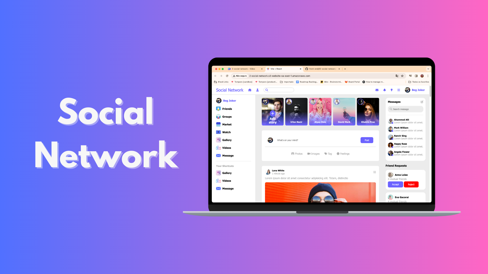
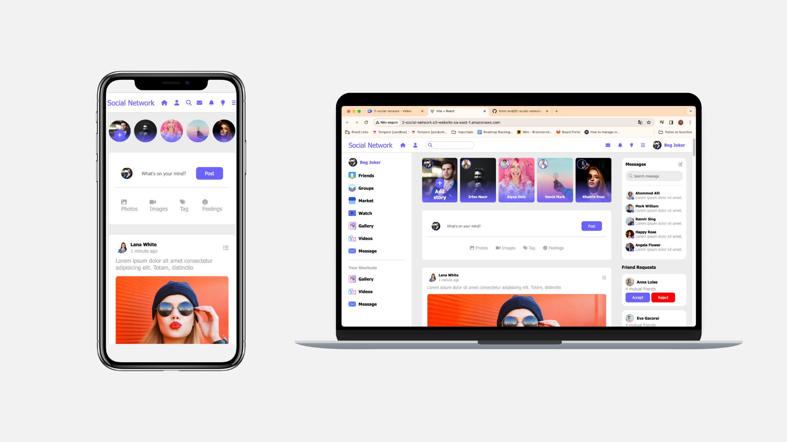
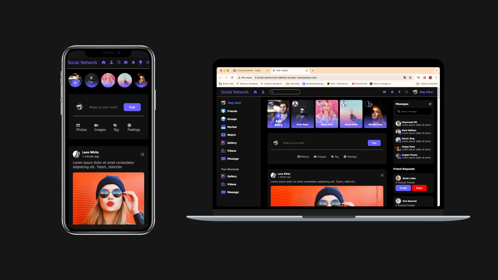
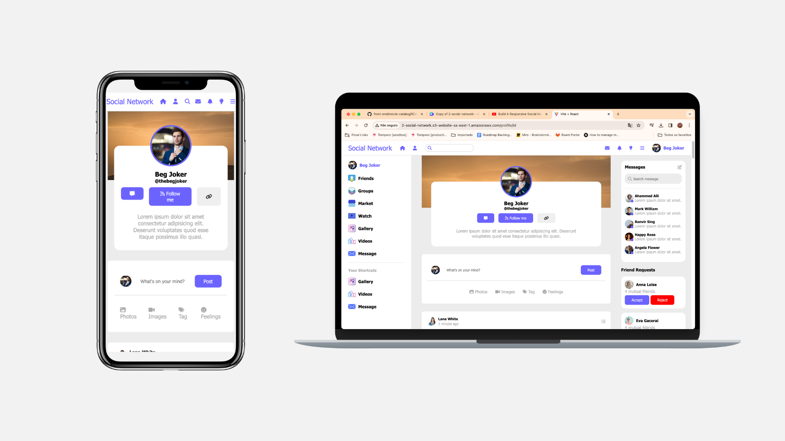
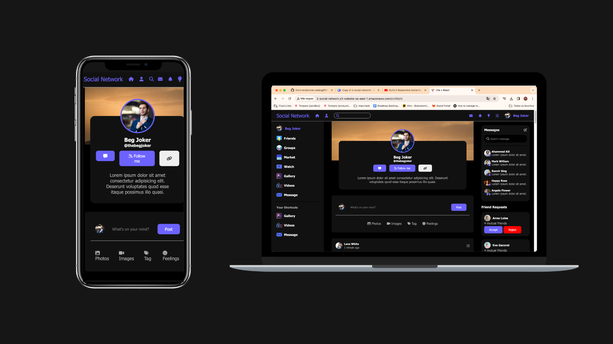
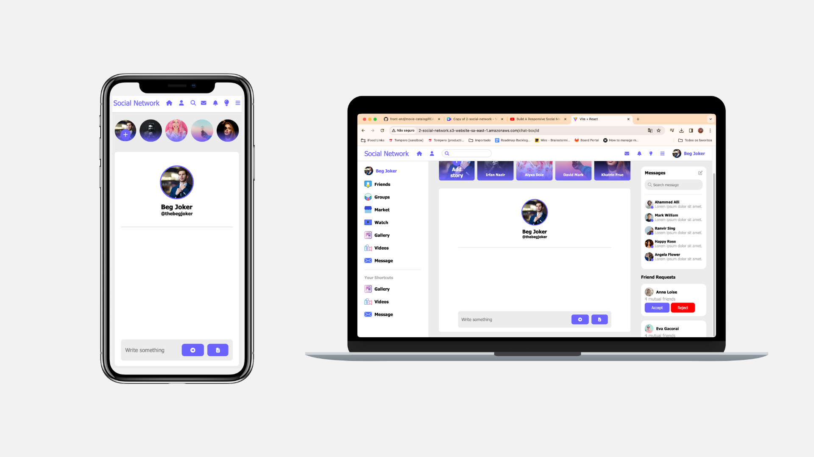
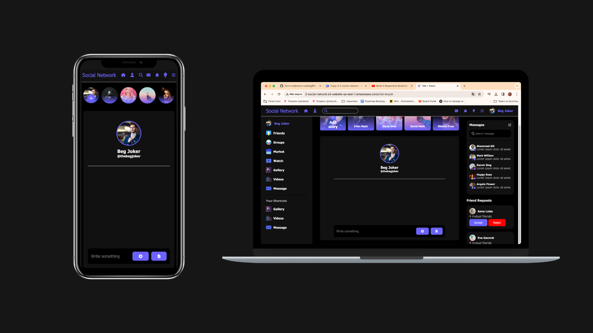

# Social Network

Uma rede social similar ao Facebook, com feed de publicações, stories, mensagens e solicitação para se tornar amigo.

A aplicação é responsiva, se adequando a dispositivos desktop, tablet e mobile. Também permite escolher entre tema light e dark.

Este projeto foi inicialmente feito em uma vídeo aula no Youtube: https://www.youtube.com/watch?v=tajyEWm11v8&t=302s

A rede social pode ser acessada em: http://2-social-network.s3-website-sa-east-1.amazonaws.com/

## Tecnologias Utilizadas 🛠️

- Vite;
- React;
- HTML;
- CSS;
- JavaScript;
- React-router-dom;

## Funcionalidades 🔎

- Feed: principal funcionalidade da aplicação, é a tela que reúne os stories, criação de publicação e listagem das publicações dos seus amigos. Também mostra as mensagens mais recentes com seus amigos, e solicitações de amizade recebidas;

- Tela de perfil: tela aberta ao clicar em um usuário. Permite pedi-lo em amigo, e ver as publicações dele;

- Mensagem: converse com seus amigos, enviando e recebendo mensagem;

