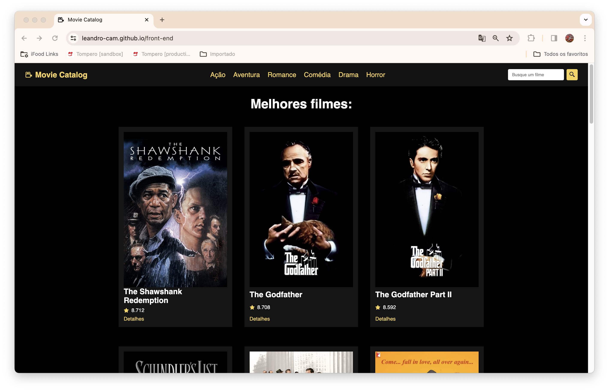
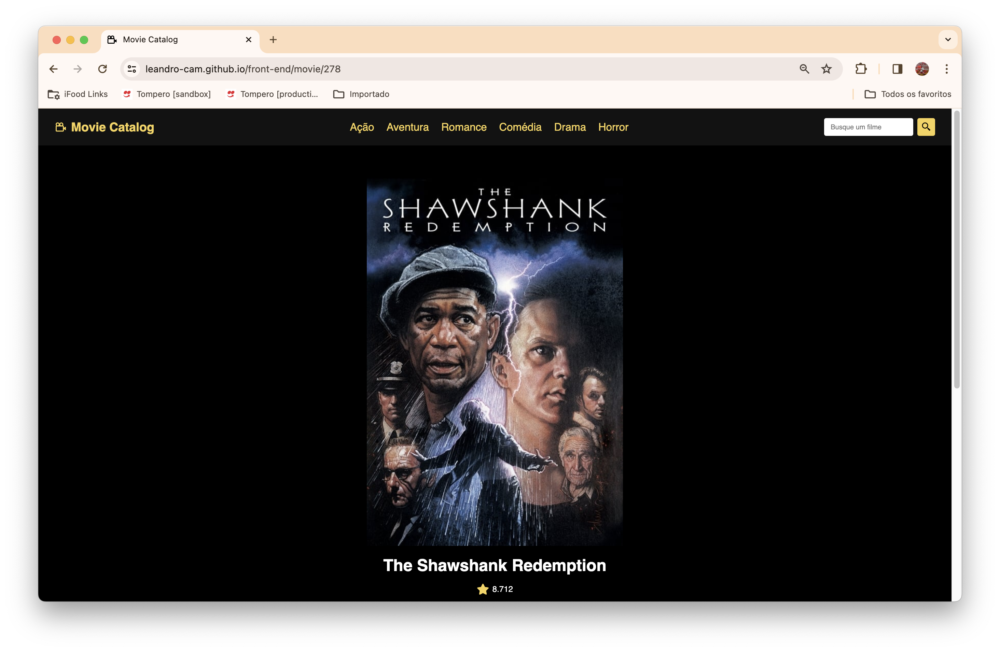
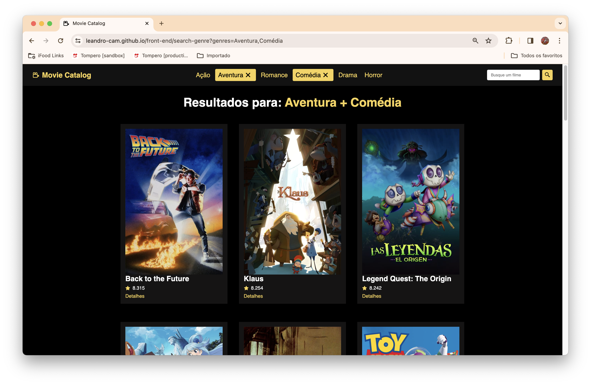
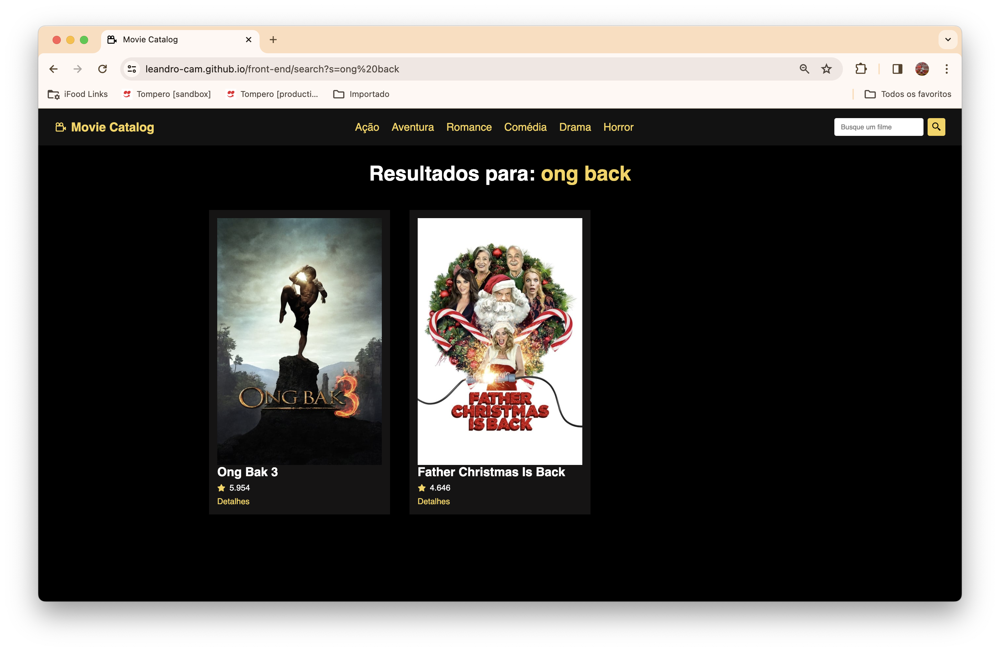

# 📽️ Movie Catalog

Um site que lista os filmes mais bem avaliados, além de contar com pesquisa por gênero e por nome. Ele utiliza a API TMDB (The Movie Database). Uma API aberta, robusta e crowdsourcing (os filmes são adicionados e a API é mantida através da contribuição da comunidade): https://developer.themoviedb.org/reference/intro/getting-started.

Este projeto foi inicialmente feito em uma aula no canal do Youtube HoraDeCodar do [@matheus.battisti](https://github.com/matheusbattisti): https://www.youtube.com/watch?v=XqxUHVVO7-U. Embora simples e minimalista, o design da interface ficou demais. Parabéns Battisti, gostei bastante! ✨. A seleção por gêneros foi por minha conta, 😋.

O site foi hospedado no GitHub Pages e pode ser acessado na URL: https://leandro-cam.github.io/front-end/

## Tecnologias Utilizadas 🛠️

- Vite;
- React;
- HTML;
- CSS;
- JavaScript;
- React-router-dom;
- TMDB (The Movie Database) API: https://developer.themoviedb.org/reference/intro/getting-started

## Funcionalidades 🔎

- Descobrir os melhores filmes: é a principal funcionalidade da aplicação, sendo a página inicial do site. São listados os 20 filmes mais bem avaliados da API TMDB;

- Ver detalhes de um filme: clique no botão _detalhes_ de um filme listado para abrir sua página de visualização;

- Descobrir os melhores filmes por gênero: selecione ou combine as tags de gênero para trazer os filmes mais bem avaliados desta seleção;

- Pesquisar um filme: utilize o campo de busca para pesquisar pelo nome de um filme.

